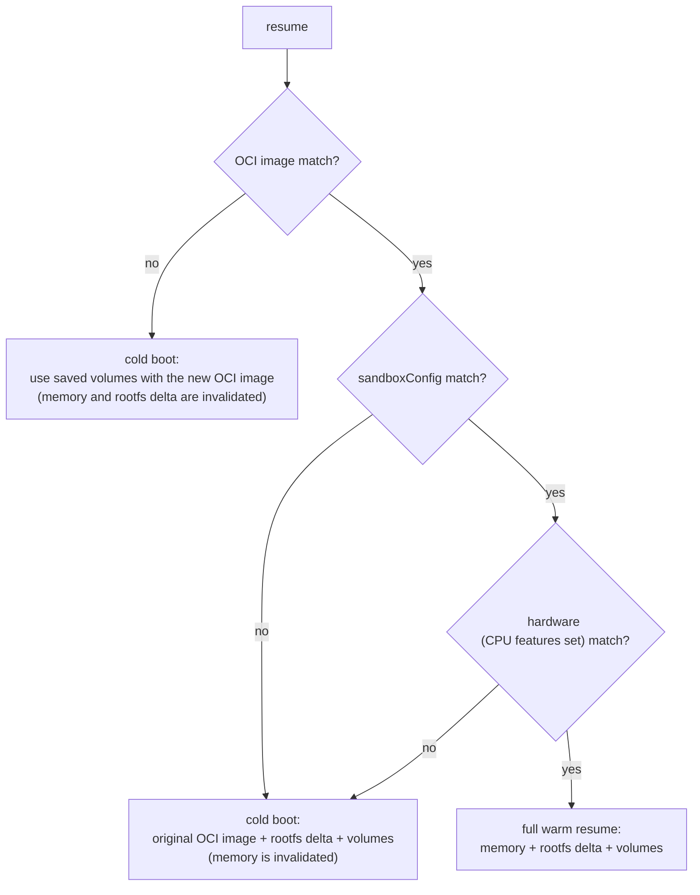
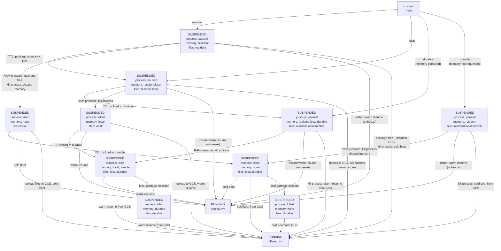

# [Design] Actor lifecycle v2: suspend/resume, layered snapshots, and the cold-boot contract

Replaces the design in #119. Related: #798 (opt-in durability), #451 / #683 (golden memory + durable data), #690 (snapshot/file cache), #660.

Compatibility: this is a breaking redesign. No migration path from `pause`/`suspend`/`onPause`/`onCommit` is provided.

## Problems with the current design

1. **Pause vs Suspend confuses users.**  Callers are forced to pick a storage tier (local vs durable) when what they actually know is only "this actor is done using CPU for now." The tier is an infrastructure cost/durability tradeoff the system is better placed to make (#798).
2. **Full/Data + devolution rules don't compose.** The `onPause`/`onCommit: full|data` scopes and the prose rules for when snapshots "devolve" (gVisor upgrade, template upgrade) are ad-hoc case analysis. Each new invalidation source (CPU family, guest kernel) adds more special cases.
3. **No story for heterogeneous hardware.** Memory snapshots depend not only on CPU architecture, but also on the specific set of CPU features that vary between generations. Nothing today defines what happens when an actor stops on one CPU family and resumes on another, or how golden snapshots and tags behave in a multi-family fleet.
4. **Golden snapshots and tags are parallel, incompatible mechanisms.** The golden snapshot is captured once per template, at registration time - a scheme that cannot accommodate hardware added to the fleet later. Tags capture actor history but cannot serve as warm fork sources (there is no way to pre-warm memory for "boot to a specific phase, then clone many times"). Two artifacts with overlapping purposes and disjoint lifecycles.

## High Level Design

### Concept
The design rests on one fundamental assertion. An actor's **truth** is small: its OCI image(s), its volumes, and (optionally) the files it changed on top of the OCI image. Everything else that we track and store - memory images, per-hardware snapshots, golden images and/or tags are **accelerators**: they exist only to make future wakeups faster, and should never be required for correctness. The system creates, replaces, and discards them on its own. Once that line is drawn, heterogeneous hardware, runtime upgrades, and template upgrades all reduce to cache misses, and our SLOs will define whether we are succeeding or failing.

### The cold-boot contract.
Every actor must be bootable from its OCI image + its volumes alone; anything not reconstructible that way must live on a volume. This is the invariant that demotes memory and rootfs snapshots to accelerators. Applications that cannot meet this contract must declare a minimumResumeFidelity floor - the worst resume they can survive - and pay for a stricter floor in scheduling freedom and blocked upgrade automation.

A cold boot sees the volumes in **crash-consistent** form — as after a power cut at the suspend instant: everything the application flushed is present; a half-finished multi-step operation may be torn. Declaring fidelity `volumes` (or `rootfs`) therefore means the application is power-cut-safe on its file data — the same claim any application makes by running on real hardware. No amount of platform-side flushing can do better: logical consistency across a suspend is achievable only by the application itself (journals, atomic writes, or quiescing before a self-initiated suspend). The contract is therefore explicit: `suspend` assumes nothing of the application, and the platform preserves exactly what the application had flushed as of the pause. File durability across suspends is the application's fsync discipline — precisely as on physical hardware.

```yaml
spec:
  lifecycle:
    # The worst resume this application can survive, named as the lowest
    # snapshot layer that must be preserved. A floor, not a preference:
    # the system resumes with the highest fidelity available, but is never
    # allowed to discard a layer this setting protects.
    minimumResumeFidelity: volumes | rootfs | memory
```

**Example 1**: Suppose an actor sets minimumResumeFidelity = memory.  If we must invalidate the memory snapshot, for any reason, that actor is CRASHED.

**Example 2**: Suppose an actor sets minimumResumeFidelity = rootfs.  If we must invalidate the memory snapshot, the actor can run a cold-start on the next wakeup, but if we must invalidate the rootfs, that actor is CRASHED.


### Snapshot layers with compatibility keys. 
A snapshot consists of three distinct layers, where rootfs delta and volumes operate independently, while the memory layer depends on both:
* memory
* rootfs delta
* volumes

Each layer is “stamped” at capture with what it depends on (image digest, sandbox runtime version, CPU class, guest kernel). When scheduling a wakeup, we try to pick a destination that matches as much as possible.  When resuming, every layer whose stamp matches the target is reused; a mismatched layer and higher are skipped, and the resume degrades gracefully from fully warm down to plain cold boot. Template upgrades, sandboxClass upgrades (ex:gVisor version), and CPU changes are not special cases - each is just a stamp mismatch. One law, **the observation rule**, governs combining layers: memory may only sit on filesystem state it had observed at capture time.



### One-verb lifecycle
`suspend` and `resume` are the whole lifecycle: an actor is **Running**, **Suspended**, or **Crashed**. An actor moves to *Crashed* when something fails underneath it — the node or sandbox dies while it is Running — or when a layer protected by its minimumResumeFidelity is lost. It is the *layers* that transition: on suspend, each layer climbs the rungs **resident → local → durable** independently, and the actor's state never changes while they do. The rungs form a pure survivability ladder:
* **resident** — the state sits in place inside the paused sandbox (memory in RAM, files on the sandbox's own disks), unpackaged; it does not survive a node restart as usable state. 
* **local** — the state has been *packaged* into a snapshot on node disk; **survives node restart**.
* **durable** — the packaged snapshot has been uploaded; **survives node loss**. 

`suspend` takes one parameter - an SLO naming the floor each layer must reach promptly, building up from the cheapest:
* **minimal** — the sandbox is paused in place: memory and files stay resident, nothing is packaged. Cheapest suspend, fastest resume — and survives nothing by itself; the system bounds the exposure by escalating to `local` via TTL or paused-process pressure.
* **local** — memory + files are packaged into a snapshot on node disk. **Survives node reboot**, fully warm.
* **durable** — the packaged files (rootfs delta + volumes) are uploaded to durable storage; memory is an optional accelerator, persisted per system policy. **Survives node loss**.

At every level, the memory + files *pair* reproduces the paused state exactly — the dirty page cache the guest had not yet written back travels inside the memory layer. Packaged files used *alone* (a cold boot, or recovery after the memory layer is lost) are crash-consistent, per the cold-boot contract.

**Resident vs local — packaging.** *Packaging* is the act of making state survive a restart: producing a consumable snapshot artifact on node disk. Unpackaging at resume also takes real time — which is why resident and local are separate rungs. The cost of packaging differs sharply per layer:
* **Files** are cheap to package, with a per-runtime difference. For microVMs the rootfs delta and volumes are host-file-backed block devices — the bytes are already on disk, so packaging is repositioning the files plus a host-side fsync (forcing the host's cached writes to physical disk — an operation on the host page cache that never touches the paused process, swapped out or not). For gVisor the bytes are on disk as sandbox-internal raw-page files; packaging rewrites them into consumable form using the page mapping. The mapping is written to disk at pause time (a cheap, small write the gVisor team proposed), so this rewrite manipulates local files only — it never needs the sandbox's memory either.
* **Memory** is the expensive layer to package: every page must be materialized to be written out, and pages the kernel swapped out while the process sat paused must first be brought back in. The cost grows with time-spent-paused and peaks under RAM pressure — so escalation policy dumps memory early (by TTL, while pages are still resident) or not at all, and under heavy pressure prefers to **package the files and discard the memory** where the fidelity floor permits: the actor loses warmth, the node avoids swap-in I/O it cannot afford, and the files still reach restart-survivability.

In both runtimes, whatever the guest had not yet flushed stays in the memory layer — the memory + files pair is exact, and packaged files-alone are crash-consistent. A guest-level "flush everything" would require running the guest or reading its memory, and buys no logical consistency anyway, so the design never requires one. (A microVM's in-place backing files may happen to be salvageable after a reboot; best-effort, dirty-grade salvage, never a contract.)

Orthogonal to the SLO, at every level: the frozen process is kept alive as long as node pressure allows (the fastest possible resume), local files linger as cache even after upload, and a background escalation engine moves layers up the ladder over time — eventually killing the frozen process, uploading layers to durable disk and deleting locally saved files. The SLO sets where layers start; escalation only ever moves them up.

What drives escalation:


The two escalation moves - killing the frozen process and uploading - are independent, so either may happen first; uploads are paced by a background NIC budget. Under pressure the coldest actors go first, and the memory of a killed frozen sandbox is captured to disk - or discarded where the fidelity floor permits. A resume cancels escalation at whatever state it reached: the actor restarts from the best copies available. The call always returns immediately; durability is observable as a condition.

**Failures are transforms on these states, not extra edges.** A node reboot kills the paused process and erases every *resident* copy — packaged local copies survive. A node loss erases every *resident* and *local* copy — only durable copies survive. If the surviving copies still satisfy the actor's minimumResumeFidelity, the actor simply continues from a worse state: resume reassembles the survivors, no special handling needed. If a protected layer lost its last copy, the actor is **CRASHED**. Two examples, in words:
* An actor suspended with memory and files both packaged and uploaded — process paused, local and durable copies of both layers — survives even a node loss: it comes back as "process killed, only the durable copies remain" and resumes warm from GCS. 
* An actor suspended at `minimal` — paused in place, nothing packaged — survives neither a reboot nor a node loss; that exposure is exactly what the escalation TTLs exist to bound. And a crash underneath a *Running* actor leaves only dirty files, so it always moves the actor to CRASHED.


### Multi-hardware support
TODO