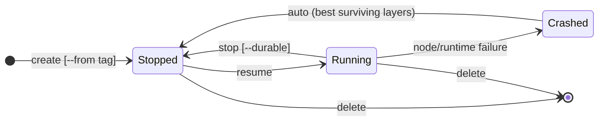

# [Design] Actor lifecycle v2: one stop verb, layered snapshots, and the cold-boot contract

Replaces the design in #119. Related: #798 (opt-in durability), #451 / #683 (golden memory + durable data), #690 (snapshot/file cache), #660.

Compatibility: this is a breaking redesign. No migration path from `pause`/`suspend`/`onPause`/`onCommit` is provided.

## Problems with the current design

1. **Pause vs Suspend confuses users.** Callers are forced to pick a storage tier (local vs durable) when what they actually know is only "this actor is done using CPU for now." The tier is an infrastructure cost/durability tradeoff the system is better placed to make (#798).
2. **Full/Data + devolution rules don't compose.** The `onPause`/`onCommit: full|data` scopes and the prose rules for when snapshots "devolve" (gVisor upgrade, template upgrade) are ad-hoc case analysis. Each new invalidation source (CPU family, guest kernel) adds more special cases.
3. **No story for heterogeneous hardware.** Memory snapshots are CPU-dependent. Nothing today defines what happens when an actor stops on one CPU family and resumes on another, or how golden snapshots and tags behave in a multi-family fleet.
4. **Golden snapshots and tags are parallel, incompatible mechanisms.** The golden snapshot is captured once per template, at registration time — a scheme that cannot accommodate hardware added to the fleet later. Tags capture actor history but cannot serve as warm fork sources (there is no way to pre-warm memory for "boot to a specific phase, then clone many times"). Two artifacts with overlapping purposes and disjoint lifecycles.

## Design overview

This section summarizes the whole design; each part names the section where it is detailed. Reading only this overview should give a complete high-level picture.

The design rests on one distinction. An actor's **truth** is small: its OCI image, its volumes, and (optionally) the files it changed on top of the image. Everything else the system stores — memory images, per-hardware snapshots, golden images — is an **accelerator**: it only makes some future boot faster, is never required for correctness, and the system creates, replaces, and discards it on its own. Once that line is drawn, heterogeneous hardware, runtime upgrades, and template upgrades all reduce to cache misses.

**The cold-boot contract (section 1).** Every actor must be bootable from its OCI image + its volumes alone; anything not reconstructible that way must live on a volume. This is the invariant that demotes memory and rootfs snapshots to accelerators. Applications that cannot meet the contract declare a `minimumResumeFidelity` floor — the worst resume they can survive — and pay for a stricter floor in scheduling freedom and blocked upgrade automation.

**Snapshot layers with compatibility keys (section 2).** A snapshot is three independent layers — memory, rootfs delta, volumes — each stamped at capture with what it depends on (image digest, runtime version, CPU class, guest kernel). At resume, every layer whose stamp matches the target is reused; a mismatched layer is skipped, and the resume degrades gracefully from fully warm down to plain cold boot. Template upgrades, gVisor upgrades, and CPU changes are not special cases — each is just a stamp mismatch. One law, the **observation rule**, governs combining layers: memory may only sit on filesystem state it had observed at capture; state it never observed may be substituted freely; memory that observed a live actor identity is never shared.

**One-verb lifecycle (section 3).** `stop` and `resume` replace pause/suspend. There is a single resting state, **Stopped**; whether the snapshot sits on local disk or in durable storage is *status*, managed by the system in the background (`stop --durable` blocks until durability, for callers who need the guarantee). History operations — tags, `revert`, `create --from` — are pure metadata over the snapshots that stops produce. The system keeps only an actor's latest snapshot; an older one survives exactly as long as a tag names it. Crash recovery is automatic: the system reassembles the best consistent set of surviving layers.

**Run kinds (section 4).** An entrypoint executes in one of two **run kinds**, distinguished by what ateom does when the actor signals readiness (`/readyz`):

- **Capture run** — exists to produce a reusable snapshot. Booted with a target-scope parameter (`global` or `atespace`), it does only work shareable at that scope and sanitizes or re-initializes everything that isn't; at readiness, ateom captures the snapshot and kills the run. Never a real actor: no identity, no ingress.
- **Serve run** — an actual actor. At readiness, ateom opens the ingress gate and the actor does its work.

How a serve run learns the way it started (fresh boot vs woken from a captured snapshot, and the contract that follows) is detailed in section 4.

**Snapshot storage and sharing (section 5).** Golden snapshots, team-shared warm bases, and rollback points are not three mechanisms — each is just a stored **snapshot** reachable through a scoped name (a **tag**):

- **The snapshot object.** A snapshot's *files* (rootfs delta + volumes) are CPU-independent, immutable, and stored exactly once. Its *memory* is a mutable map of per-CPU-class materializations, created on demand and evicted freely. All hardware diversity lives in that map; the files never care. Entries are keyed by the guest-visible CPU class they were captured for, so an entry serves every node offering that class. (Named vCPU feature tiers that would widen each entry's compatibility across machine generations are a possible future extension.)

  ```
  tag "xyz" ──▶ snapshot S
                 ├─ files (rootfs delta + data)      ← one copy, read-only, never touched
                 └─ memory:
                      ├─ {cpu: gen6} → memory image + that run's write-delta
                      └─ {cpu: gen1} → memory image + that run's write-delta
  ```

- **Tag scopes.** The snapshot is the data; a tag is a name for it. Snapshots are created by the system (every `stop` and every capture run produces one); the system keeps only an actor's latest, and an older snapshot survives exactly as long as a tag names it. A tag attaches the two things a snapshot lacks — a human-chosen name and a **scope** deciding who may `create --from` it: **actor** (rollback of one actor), **atespace** (shared inside one ate-space), **global** (fleet-wide). Deleting a tag deletes only the name — the data goes when nothing references it anymore. The golden snapshot is not a separate mechanism — it is the global tag automatically created at template registration, pointing at the template's (empty) root snapshot. `promote` turns an actor snapshot into a shareable tag by deriving a new, sanitized snapshot through a capture run.

The rule that ties this part together: **a materialization miss never blocks anyone.** A resume landing on hardware with no matching memory entry proceeds immediately as a cold boot from the snapshot's files, and the miss triggers a background fill for next time — the tag itself is never regenerated, copied per hardware, or invalidated. (Warm clones apply to promoted tags; an actor-scope rollback tag shares its files only, since stop-captured memory contains identity and is never shared. The mechanics — miss events, the materialization controller, and the copy-on-write write-deltas that keep snapshot files byte-identical — are in sections 5 and 7.)

Sections 6–7 cover the supporting detail: durable upload and cache-aware resume scheduling. Section 8 summarizes all API changes at a glance.

## 1. The cold-boot contract

> For every ActorTemplate, booting a fresh sandbox from the OCI image and attaching the actor's volumes MUST produce a correct actor. Anything not reconstructible this way MUST live on a volume.

This is a requirement on the *application*, and not every workload can meet it today, so the template declares its tolerance:

```yaml
spec:
  lifecycle:
    # The worst resume this application can survive, named as the lowest
    # snapshot layer that must be preserved. A floor, not a preference:
    # the system resumes with the highest fidelity available, but is never
    # allowed to discard a layer this setting protects.
    minimumResumeFidelity: volumes | rootfs | memory
```

"Fidelity" is how faithful the resumed actor is to its state at stop time: a warm resume preserves everything; a cold boot from image + volumes preserves only the volumes. Each value states which layers the system may **discard** when their compatibility keys stop matching:

- **`volumes`** (default) — "I can rebuild everything from my OCI image plus my volumes": the full cold-boot contract. Memory and rootfs delta are discardable accelerators.
- **`rootfs`** — "I survive losing process memory, but files I wrote outside my volumes are essential and not recreatable" (e.g. tools installed into the rootfs at runtime with no record of them). Memory is discardable; the rootfs delta is not.
- **`memory`** — "my live process state is irreplaceable" (e.g. sessions held purely in RAM). Nothing is discardable. The expensive escape hatch, not a recommendation.

The floor translates directly into how far a resume may degrade: at `volumes`, all the way down to a plain cold boot (image + volumes only); at `rootfs`, no further than a cold boot with all files intact; at `memory`, no degradation at all — if a warm resume is impossible on every available node, the actor stays Stopped until compatible capacity exists. Concretely, per event:

| | `volumes` | `rootfs` | `memory` |
|---|---|---|---|
| Resume on different CPU class | ✓ | ✓ (cold boot, files intact) | ✗ |
| Runtime (gVisor/VMM) upgrade | ✓ | ✓ | ✗ |
| Actor's OCI image change (template upgrade) | ✓ (cold boot from the new image; volumes carried over) | ✗ (would discard the rootfs delta) | ✗ |
| Scheduling freedom | any node | any node | nodes where the memory key matches |


`volumes` is the default: the contract is enforced from day one, and `rootfs`/`memory` are escape hatches for workloads that cannot (yet) externalize their state. A stricter fidelity narrows scheduling freedom and blocks upgrade automation; that cost is the actor owner's, made explicit.

## 2. Snapshot layers and compatibility keys

| Layer | Contents | Compatibility key (stamped at capture) |
|---|---|---|
| **memory** | Guest memory + vCPU/device state | image digest, runtime kind + version, CPU class, guest kernel (uVM) |
| **rootfs** | Filesystem delta on top of the OCI image | image digest |
| **volumes** | Content of snapshot-capable volumes (durableDir, …) | — (always valid) |

### How the key is used

When a layer is captured, it is stamped with the environment it was captured in — the values in the third column above. When the system later wants to resume the actor somewhere, it compares each layer's stamp against the resume target: the candidate node's runtime version and CPU class, and the actor's *current* template version. (The **CPU class** is the CPU as the guest sees it — in v1 the host machine's CPU family/generation, since the guest is exposed to the host CPU.)

- Every field matches → the layer is **valid** and can be reused for this resume.
- Any field differs → the layer is **invalid** for this target. It is skipped, and the resume falls back to rebuilding that part (see "Resume plan selection" below).

A worked example: an actor stopped on a node running gVisor 1.5, gen-6 CPUs, image digest `X`. Later it resumes on a node that was upgraded to gVisor 1.6. The memory layer's stamp says "gVisor 1.5" — mismatch, so the memory layer is skipped. The rootfs layer's stamp only contains the image digest, which is still `X` — match, so the files are reused. The volumes carry no stamp and are always reused. Result: the actor resumes with all its files, but cold-boots instead of waking up warm.

### The observation rule

Key matching decides whether each layer is valid *on its own*. Whether valid layers may be **combined in the same resume** is governed by a single rule:

> A memory image may be resumed only on top of exactly the filesystem state it had already observed when it was captured. State it never observed may be substituted freely. A memory image that has observed a live actor identity may never be reused by another actor.

The reason is mechanical: a running process holds copies of the files it has read — page cache, mapped binaries and libraries, open-file state — inside its memory. Resume the memory over a filesystem that disagrees with those copies and the process misbehaves in undebuggable ways. Identity is the same problem one level up: credentials, hostnames, and session state baked into memory would be cloned into actors they don't belong to.

What a given memory image has observed — and therefore what it may be paired with and who may reuse it — is determined by the kind of run that captured it; sections 4 and 5 apply this rule to each capture context.

### Resume plan selection

Given the observation rule, plan selection is deterministic. Let *M*, *R* be the actor's captured memory/rootfs layers, valid = key matches target:

| R valid? | M valid? | Plan |
|---|---|---|
| yes | yes | **A. Warm resume**: M + R + volumes |
| yes | no | **C. Cold boot with state**: image + R + volumes (M discarded — observation rule forbids pairing it with anything else) |
| no (or never captured) | — | **B. Golden-accelerated boot**: root-snapshot memory + pristine image + volumes, if a materialization exists for this placement; else **D. Plain cold boot**: image + volumes |

Which layers an event invalidates follows directly from the stamps: a CPU class change, runtime upgrade, or guest kernel upgrade invalidates only memory; an OCI image change invalidates memory and rootfs; nothing invalidates volumes. (How each event then plays out per fidelity value is the consequences table in section 1.) New invalidation sources are new key fields, not new rules.

## 3. Lifecycle and API

### States



There is a single resting state, **Stopped**. Where the snapshot lives (local disk, durable storage) is *status*, not *state*:

```yaml
status:
  snapshotGeneration: 41        # latest capture
  durableGeneration: 40        # highest generation fully in durable storage
  layers:
    # tiers is an array: a layer can be present locally and/or durably.
    # Local copies record which node VMs hold them — needed by locality-aware
    # scheduling (section 7) today, and by a future feature distributing
    # layers across machines.
    memory:  {present: true, tiers: [{local: [node-a]}],                     key: {image: sha256:…, runtime: gvisor/…, cpu: gen6}}
    rootfs:  {present: true, tiers: [{local: [node-a]}, {durable: <ref>}],   key: {image: sha256:…}}
    volumes:                        # one entry per template volume
      - {name: data,  present: true, tiers: [{local: [node-a]}, {durable: <ref>}]}
      - {name: cache, present: true, tiers: [{local: [node-a]}]}
```

### Verbs

Two verb groups, matching the two object lifecycles (noun-first CLI: `ate actor …`, `ate tag …`).

**Actor lifecycle:**

- **`create [--from <tag>]`** — make a new Stopped actor, from the template (its root snapshot's global tag, section 5) or from any tag the caller's scope permits. No placement happens at create.
- **`resume`** — pick a resume plan (section 2) at or above the template's fidelity floor; scheduling prefers layer locality (section 7).
- **`stop [--durable]`** — capture a snapshot (memory + rootfs delta + volumes, always all three), release CPU/RAM, return. Each stop *replaces* the actor's current snapshot — the system keeps only the latest, so tag first to preserve one; there is no separate snapshot-taking verb. Upload to durable storage happens in the background (section 6). `--durable` additionally blocks until `Durable=True` — the #798 opt-in: an explicit durability barrier instead of a different verb.
- **`revert --to <t>`** — point a Stopped actor back at a tagged snapshot.
- **`delete`** — remove the actor and its current snapshot; tagged snapshots live exactly as long as their tags.

**Tag lifecycle:**

- **`tag <t> --actor <a>`** — pure metadata: name the actor's current snapshot at actor scope, keeping it alive past future stops and making it revert-able and forkable. Capturing a history point *without* stopping the actor is deliberately out of v1.
- **`promote <tag> --scope atespace|global`** — derive a shareable tag via a sanitizing capture run (section 5). Actor-scope tags need no promotion; wider scopes require the derivation.
- **`delete <t>`** — remove the name only, never data.

### Crashed

With background upload always running, crash recovery is system-driven. On node/runtime failure the actor moves to Crashed, the system inventories surviving layers (local layers survive node reboots; durable layers always survive), and transitions to Stopped with the best consistent set per the observation rule. `revert --to` remains available when the surviving head is undesirable. A `dump` equivalent ("salvage whatever the still-alive node has, as a tag") survives as a debugging tool: tagging the salvaged snapshot of a Crashed actor whose node is still reachable.

## 4. Run kinds, boot hints, and the capture point

This is the load-bearing section: golden materialization, warm clones, template upgrades (#451), and resume plan B all rest on it.

An entrypoint executes in one of two **run kinds**:

| Run kind | Purpose | Identity | Ingress | Ends with |
|---|---|---|---|---|
| **capture run** | pre-warm memory for later reuse; sanitize for the target scope; never serve | none — a system run, not an actor | never opened | capture at readyz, then the run is killed |
| **serve run** | a real actor doing its work | delivered | normal | normal actor lifetime |

### The capture run

A capture run boots, executes its startup script, reaches the readyz point, is captured there, and is killed. It never becomes a real actor. The startup script receives the run kind and, as its sub-parameter, the **target scope** (`global` or `atespace`, section 5), so it can behave accordingly: do only work shareable at that scope; download what is worth pre-warming; and *sanitize — clean everything that must not leak into the target scope* (credentials, logs, per-actor content) before it starts answering 200 on `/readyz`.

What the platform attaches before the run enforces the observation rule (section 2) rather than trusting the script:

- **Global scope** (template root snapshot): no volumes, no identity. The script must sanitize for global sharing — the result may carry no assumption about any actor *or any atespace*. The captured memory pairs with any volumes — this is what keeps warm template upgrades (#451) possible.
- **Atespace scope** (promotion or re-materialization): the source snapshot's rootfs delta + data are attached; still no identity. Concrete-actor data must be sanitized out, but data shared between actors of the same atespace may remain. The captured memory pairs with exactly the attached content.

Nobody calls readyz from inside the guest: ateom starts (or resumes) the sandbox and polls the actor's `/readyz` endpoint until it returns 200. In a capture run, that first 200 is the capture trigger — ateom quiesces the sandbox, captures, and kills the run. Ingress was never opened, so no requests are in flight: a clean capture point. A capture run that fails to reach readiness within a timeout is a failed materialization run: logged, retried with backoff, and never anyone's problem — a missing materialization only means the next boot is cold.

### The serve run

A serve run is a real actor. From ateom's point of view both starts are the same algorithm — start or resume the sandbox, poll `/readyz` until 200, open the network. The difference lives entirely in the actor, told to it as a **boot hint**:

- **`coldboot`** — booted fresh, no usable memory image (first boot, hardware changed, template changed, materialization miss, …). Run parameters (run kind, boot reason, identity) arrive as environment variables at process start, as today.
- **`warmboot`** — ateom resumes the process from a full snapshot, waits for 200 on `/readyz`, and opens the network. The resumed process's environment still describes the capture run, so how the actor learns its new identity and integrates volume content is deliberately left open rather than designed here (candidates: a refreshable context file, a metadata endpoint, an ateom-invoked hook). One captured image wakes into many actors, so fork safety — RNG reseeding, regenerating anything that must be unique per instance — is part of the same open question.

## 5. Snapshots and scoped tags

### Snapshots

A **snapshot** is taken by the system at `stop` time and always contains all three layers — memory, rootfs delta, volumes — stamped as described in section 2. Each actor has exactly one snapshot, its latest. Capture runs produce snapshots too: a template's root snapshot at registration, and a promoted tag's snapshot at promotion.

As today, a snapshot's content is a small **metadata JSON** plus the actual blobs: the memory image, the rootfs delta, and the volume snapshots. The metadata captures what is needed to decide reuse: sandboxConfig (runtime kind and version), CPU generation, OCI image digest, guest kernel, plus blob references and sizes.

### Tags

A **tag** is a named, **scoped**, immutable reference to a snapshot (`name, scope → snapshot`). The tag stores no per-hardware state: hardware diversity lives entirely in the snapshot's memory list, and when a new CPU class gets filled, nothing about the tag changes.

| Scope | Visible to / clonable by | Typical use | How it comes to exist |
|---|---|---|---|
| **actor** | the owning actor only | rollback (`revert --to`) | tagging the actor's current snapshot — pure metadata, no run, may contain identity |
| **atespace** | actors in the ate-space | team-shared warm base | `promote --scope atespace`: a sanitizing capture run |
| **global** | the whole fleet | golden; platform-blessed bases | template registration (automatic), or `promote --scope global` (privileged) |

**The golden snapshot is a global tag.** Registering a template creates its **root snapshot** (empty rootfs delta, empty volumes) and a global tag pointing at it (`template:<name>@<version>`). "Create an actor from the template" is `create --from` that tag. There is no separate golden artifact, storage path, or API.

### Promotion is a derivation, not a rename

`promote` does not relabel the source snapshot — it **derives a new one**. The system schedules a capture run with the target scope: boot from the source snapshot's rootfs + data (a cold boot), let the script download anything worth pre-warming and delete everything that must not leak into the target scope, capture at readyz. The result is a new snapshot — sanitized files + warm memory — and the tag points at it. The source snapshot stays at actor scope, untouched; a bug in the cleaning script is fixed by re-promoting, with nothing lost. Promotion composes: an atespace tag can later be promoted to global, which is just another derivation run.

### Re-warming a tag on missing hardware

Placement is unknown at `create --from` — creation only produces a Stopped actor record. So the gap shows at **resume time**: an actor resumed from a tag lands on a CPU class for which the snapshot has no memory entry. The resume itself proceeds immediately as a cold boot from the snapshot's files; in parallel, the **materialization controller** schedules a capture run on the missing hardware.

That run is *not* a promotion. Its input is the already-sanitized snapshot, and its only output is **one new memory entry appended to that same snapshot** — neither rootfs nor volumes change. The resulting structure: one set of files, one memory entry per CPU class:

```
tag "xyz" ──▶ snapshot S
               ├─ files (rootfs delta + data)      ← one copy, read-only, never touched
               └─ memory:
                    ├─ {cpu: gen6} → memory image + that run's write-delta
                    └─ {cpu: gen1} → memory image + that run's write-delta   ← added by the re-warm run
```

How the run knows the difference: capture runs carry a **purpose** parameter alongside the target scope —

- `promote`: "sanitize for the target scope; your result becomes a new snapshot."
- `materialize`: "the attached content is already sanitized; just boot to ready — no sanitization needed."

And the prohibition on changing files is not left to the script's good behavior. The platform attaches the snapshot's files as **read-only, copy-on-write layers**: everything the run writes (bytecode caches, re-downloads) lands in a private **write-delta** that is stored with the new memory entry, used only with it, and evicted with it — never merged into the snapshot. The files stay byte-identical no matter what the run does; each memory entry stays self-consistent (its memory agrees with files + its own delta); at warmboot a clone stacks image → snapshot files → the entry's delta (read-only) → its own fresh writable layer.

Controller mechanics, briefly: **single-flight** per (snapshot, CPU class) — a thousand simultaneous cold resumes produce one run, not a thousand; **policy-gated** — triggered on first miss, never for actor-scope stop snapshots (their memory observed identity and is never shared); **background priority** — warming never competes with serving actors for capacity; **failure-tolerant** — retry with backoff, and a persistently failing run just leaves that CPU class cold. The complete trigger list:

| Trigger | Run |
|---|---|
| Template registered | pre-warm the root snapshot for CPU classes currently in the fleet (policy: all, or hot templates only) |
| Miss event: first resume of an actor onto a CPU class with no root-snapshot materialization | the actor cold boots now; a capture run fills the cache in the background |
| `promote` to atespace/global | one capture run at promotion time (produces the sanitized snapshot + its first materialization) |
| Miss event: first resume of a clone of a shared tag onto a CPU class with no materialization | the clone cold-forks now (plan C); a background run materializes for the next one |

The unifying rule: **a materialization miss never blocks anyone.** It costs the requester one cold boot and triggers a background fill.

Snapshot and tag status surfaces the resulting distinction: which placements are currently *accelerated* (a memory entry exists) vs merely *bootable* (always true while the snapshot exists).

## 6. Durable upload policy

Simple and uniform: the whole snapshot — metadata, memory, rootfs delta, volumes — uploads to durable storage as one unit, in the background after every `stop`, and synchronously under `stop --durable`. Local copies are retained after upload (they are the fast tier) and evicted under disk pressure per #690 cache policy.

## 7. Scheduling a resume

At resume time the scheduler picks a placement, preferring the warmest start the snapshot allows.

**When neither the OCI image nor the sandboxConfig changed** since the snapshot was taken:

1. **Same machine** — prefer the node already holding the snapshot locally: zero transfer, warm resume.
2. **Same CPU class** — otherwise, a node of the same CPU class; the snapshot is downloaded from durable storage, still a warm resume.
3. **Any machine, cold boot** — otherwise, cold boot from the snapshot's files anywhere (permitted only when `minimumResumeFidelity` is not `memory`); the miss triggers a background re-warm where applicable (section 5).

**When the sandboxConfig changed:** the memory image is invalid on every machine — cold boot with rootfs delta + volumes, any machine (fidelity `volumes` or `rootfs`).

**When the OCI image changed** (template upgrade): memory and rootfs delta are both invalid — cold boot from the new image + volumes, any machine (fidelity `volumes` only).

The first resume of a clone runs the same ladder against the source tag's snapshot: warm where its memory list has an entry for the placement's CPU class, cold otherwise.

Each rung is a preference, not a pin: if the preferred machines lack capacity beyond a small wait budget, the scheduler falls through to the next rung rather than queueing indefinitely.

## 8. API changes at a glance

Everything above, reduced to the surface a user or client touches.

### Verbs

| Verb | Object | Effect |
|---|---|---|
| `create [--from <tag>]` | actor | new Stopped actor, from the template's global tag (default) or any tag the caller's scope permits; no placement happens at create |
| `resume` | actor | place and start per the ladder in section 7 |
| `stop [--durable]` | actor | capture the full snapshot (memory + rootfs delta + volumes), release compute; replaces the actor's previous snapshot; `--durable` blocks until the upload completes |
| `revert --to <t>` | actor | point a Stopped actor back at a tagged snapshot |
| `delete` | actor | remove the actor and its current snapshot; tagged snapshots outlive it |
| `tag <t> --actor <a>` | tag | name the actor's current snapshot at actor scope — pure metadata, keeps that snapshot alive past future stops |
| `promote <tag> --scope atespace\|global` | tag | derive a sanitized, shareable snapshot via a capture run; global promotion is privileged |
| `delete <t>` | tag | remove the name only; data is freed when nothing references it |

As a `service Control` snippet:

```proto
service Control {
  //   ...

  // CHANGED: CreateActorRequest gains from_tag — create from the template's
  // root-snapshot tag (default) or any tag the caller's scope permits.
  rpc CreateActor(CreateActorRequest) returns (Actor) {}

  // NEW: replaces SuspendActor + PauseActor. Captures the full snapshot
  // (memory + rootfs delta + volumes), releases compute; upload to durable
  // storage runs in the background. StopActorRequest.durable blocks the
  // call until the upload completes.
  rpc StopActor(StopActorRequest) returns (StopActorResponse) {}

  // NEW: point a Stopped actor back at a tagged snapshot.
  rpc RevertActor(RevertActorRequest) returns (Actor) {}

  // CHANGED: pure metadata — names the actor's current snapshot at actor
  // scope and pins it; no copy is made.
  rpc CreateTag(CreateTagRequest) returns (Tag) {}

  // NEW: derive a sanitized, shareable snapshot via a capture run and
  // return the new tag at the requested scope (atespace | global; global
  // is privileged).
  rpc PromoteTag(PromoteTagRequest) returns (Tag) {}

  //   ...
}

// ---------------------------------------------------------------------
// DELETED — both replaced by StopActor: the caller no longer picks the
// storage tier; tiering is system policy, observable in actor status.
//
//   rpc SuspendActor(SuspendActorRequest) returns (SuspendActorResponse) {}
//   rpc PauseActor(PauseActorRequest) returns (PauseActorResponse) {}
// ---------------------------------------------------------------------
```

### States and status

One resting state instead of two; where the snapshot lives (local / durable) becomes *status*, not state (section 3). Field numbers are illustrative:

```proto
enum ActorState {
  ACTOR_STATE_UNSPECIFIED = 0;
  ACTOR_STATE_RESUMING = 1;
  ACTOR_STATE_RUNNING = 2;

  // Removed: the suspend/pause split.
  reserved 3 to 6;
  reserved "ACTOR_STATE_SUSPENDING", "ACTOR_STATE_SUSPENDED",
           "ACTOR_STATE_PAUSING", "ACTOR_STATE_PAUSED";

  ACTOR_STATE_CRASHED = 7;
  ACTOR_STATE_DELETING = 8;

  // NEW: the single resting state.
  ACTOR_STATE_STOPPING = 9;
  ACTOR_STATE_STOPPED = 10;
}

message ActorStatus {
  ActorState state = 1;

  // Removed: the external/local snapshot split — where a snapshot lives
  // is per-layer status on the snapshot itself, not two different fields.
  reserved 4, 5;
  reserved "external_snapshot", "local_snapshot_info";

  //   ...

  // NEW: the actor's current (latest) snapshot and where it lives.
  SnapshotStatus snapshot = 10;
}

// NEW
message SnapshotStatus {
  string snapshot_id = 1;              // system-generated; never user-addressable
  int64 snapshot_generation = 2;       // latest capture
  int64 durable_generation = 3;        // highest generation fully in durable storage;
                                       // Durable == (snapshot_generation == durable_generation)
  repeated LayerStatus layers = 4;     // memory, rootfs, and one entry per volume
}

// NEW
message LayerStatus {
  LayerKind kind = 1;
  bool present = 2;
  repeated LayerLocation tiers = 3;    // a layer can exist locally and/or durably
  CompatibilityStamp key = 4;          // what this layer depends on (section 2)

  // Set only when kind == LAYER_KIND_VOLUME: the template volume this
  // layer captures (matches ActorTemplate.volumes[].name).
  string name = 5;
}

// NEW: one copy of a layer. LOCAL copies record which node VMs hold them —
// for locality-aware scheduling (section 7) and a future feature
// distributing layers across machines.
message LayerLocation {
  LayerTier tier = 1;                    // LOCAL | DURABLE
  repeated string nodes = 2;             // LOCAL: node VMs holding the copy
  string ref = 3;                        // DURABLE: object-storage reference
}

// NEW
enum LayerKind {
  LAYER_KIND_UNSPECIFIED = 0;
  LAYER_KIND_MEMORY = 1;
  LAYER_KIND_ROOTFS = 2;
  LAYER_KIND_VOLUME = 3;   // one LayerStatus entry per volume, named
}

// NEW
enum LayerTier {
  LAYER_TIER_UNSPECIFIED = 0;
  LAYER_TIER_LOCAL = 1;
  LAYER_TIER_DURABLE = 2;
}

// NEW: the compatibility stamp (section 2). memory uses every field;
// rootfs only image_digest; volumes carry no stamp.
message CompatibilityStamp {
  string image_digest = 1;
  string runtime = 2;               // sandbox runtime kind+version, e.g. "gvisor/1.6"
  string cpu_class = 3;             // guest-visible CPU class, e.g. "gen6"
  string guest_kernel = 4;          // uVM only
}

// ---------------------------------------------------------------------
// DELETED — the paused-only node-local bookkeeping; local vs durable is
// now the per-layer tier in SnapshotStatus.
//
//   message LocalSnapshotInfo { … }
// ---------------------------------------------------------------------
```

### ActorTemplate fields

```proto
message ActorTemplate {
  //   ...

  // Removed: SnapshotsConfig (on_pause / on_commit / on_resume, and the
  // SnapshotContentScope / OnResumeConfig / ResumeSource types with it).
  // stop always captures all three layers; resume behavior derives from
  // the compatibility stamps and minimum_resume_fidelity.
  reserved 5;
  reserved "snapshots_config";

  //   ...

  // NEW: the lifecycle contract (section 1).
  LifecycleConfig lifecycle = 9;
}

// NEW
message LifecycleConfig {
  // The worst resume this application can survive — a floor, not a
  // preference (section 1). UNSPECIFIED reads as VOLUMES.
  ResumeFidelity minimum_resume_fidelity = 1;

  // Base object-storage URI snapshots are stored under.
  // (Moved from SnapshotsConfig.storage_location.)
  string storage_location = 2;
}

// NEW
enum ResumeFidelity {
  RESUME_FIDELITY_UNSPECIFIED = 0;  // reads as VOLUMES
  RESUME_FIDELITY_VOLUMES = 1;
  RESUME_FIDELITY_ROOTFS = 2;
  RESUME_FIDELITY_MEMORY = 3;
}

message ActorTemplateStatus {
  reserved 1;
  reserved "golden_snapshot_status";

  // NEW: the global tag auto-created at registration, pointing at this
  // version's root snapshot ("template:<name>@<version>", section 5).
  // Everything golden-related is reachable through it.
  string golden_tag = 2;
}

// ---------------------------------------------------------------------
// DELETED — message removed entirely, no replacement type. The golden is
// just a tag now; per-CPU-class materializations live in snapshot status
// (section 5), not on the template.
//
//   message GoldenSnapshotStatus {
//     ...
//   }
//
// DELETED — stop always captures all three layers, and resume behavior
// derives from the compatibility stamps and minimum_resume_fidelity.
// Only storage_location survives, moved to LifecycleConfig.
//
//   message SnapshotsConfig {
//     ...
//   }
// ---------------------------------------------------------------------
```
