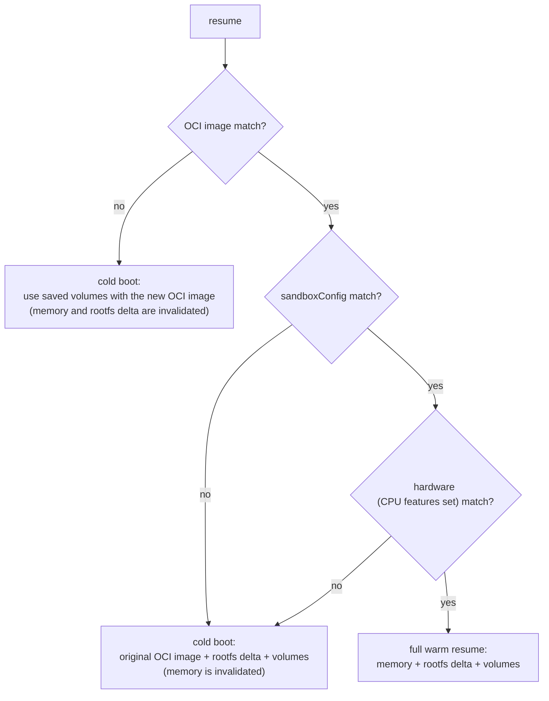
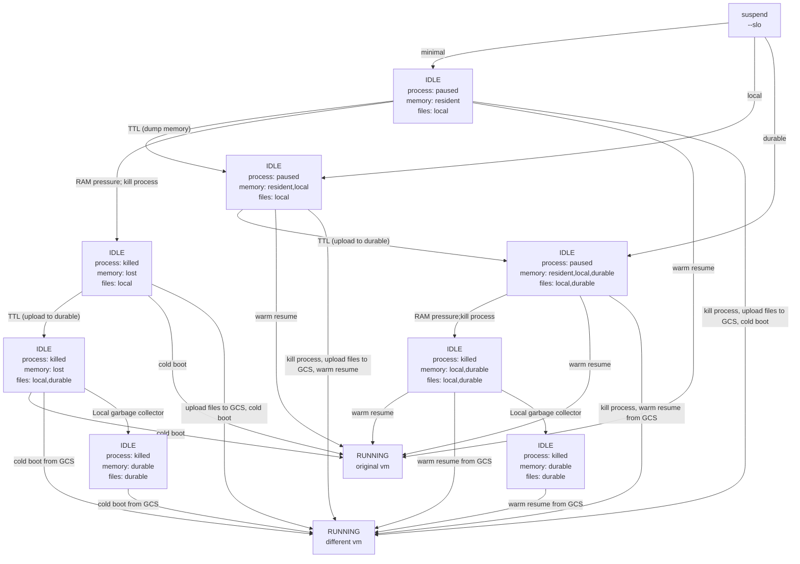

# [Design] Actor lifecycle v2: one stop verb, layered snapshots, and the cold-boot contract

Replaces the design in #119. Related: #798 (opt-in durability), #451 / #683 (golden memory + durable data), #690 (snapshot/file cache), #660.

Compatibility: this is a breaking redesign. No migration path from `pause`/`suspend`/`onPause`/`onCommit` is provided.

## Problems with the current design

1. **Pause vs Suspend confuses users.**  Callers are forced to pick a storage tier (local vs durable) when what they actually know is only "this actor is done using CPU for now." The tier is an infrastructure cost/durability tradeoff the system is better placed to make (#798).
2. **Full/Data + devolution rules don't compose.** The `onPause`/`onCommit: full|data` scopes and the prose rules for when snapshots "devolve" (gVisor upgrade, template upgrade) are ad-hoc case analysis. Each new invalidation source (CPU family, guest kernel) adds more special cases.
3. **No story for heterogeneous hardware.** Memory snapshots depend not only on CPU architecture, but also on the specific set of CPU features that vary between generations. Nothing today defines what happens when an actor stops on one CPU family and resumes on another, or how golden snapshots and tags behave in a multi-family fleet.
4. **Golden snapshots and tags are parallel, incompatible mechanisms.** The golden snapshot is captured once per template, at registration time - a scheme that cannot accommodate hardware added to the fleet later. Tags capture actor history but cannot serve as warm fork sources (there is no way to pre-warm memory for "boot to a specific phase, then clone many times"). Two artifacts with overlapping purposes and disjoint lifecycles.

## High Level Design

### Concept
The design rests on one fundamental assertion. An actor's **truth** is small: its OCI image(s), its volumes, and (optionally) the files it changed on top of the OCI image. Everything else that we track and store - memory images, per-hardware snapshots, golden images and/or tags are **accelerators**: they exist only to make future wakeups faster, and should never be required for correctness. The system creates, replaces, and discards them on its own. Once that line is drawn, heterogeneous hardware, runtime upgrades, and template upgrades all reduce to cache misses, and our SLOs will define whether we are succeeding or failing.

### The cold-boot contract.
Every actor must be bootable from its OCI image + its volumes alone; anything not reconstructible that way must live on a volume. This is the invariant that demotes memory and rootfs snapshots to accelerators. Applications that cannot meet this contract must declare a minimumResumeFidelity floor - the worst resume they can survive - and pay for a stricter floor in scheduling freedom and blocked upgrade automation.

```yaml
spec:
  lifecycle:
    # The worst resume this application can survive, named as the lowest
    # snapshot layer that must be preserved. A floor, not a preference:
    # the system resumes with the highest fidelity available, but is never
    # allowed to discard a layer this setting protects.
    minimumResumeFidelity: volumes | rootfs | memory
```

**Example 1**: Suppose an actor sets minimumResumeFidelity = memory.  If we must invalidate the memory snapshot, for any reason, that actor is CRASHED.

**Example 2**: Suppose an actor sets minimumResumeFidelity = rootfs.  If we must invalidate the memory snapshot, the actor can run a cold-start on the next wakeup, but if we must invalidate the rootfs, that actor is CRASHED.


### Snapshot layers with compatibility keys. 
A snapshot consists of three distinct layers, where rootfs delta and volumes operate independently, while the memory layer depends on both:
* memory
* rootfs delta
* volumes

Each layer is “stamped” at capture with what it depends on (image digest, sandbox runtime version, CPU class, guest kernel). When scheduling a wakeup, we try to pick a destination that matches as much as possible.  When resuming, every layer whose stamp matches the target is reused; a mismatched layer and higher are skipped, and the resume degrades gracefully from fully warm down to plain cold boot. Template upgrades, sandboxClass upgrades (ex:gVisor version), and CPU changes are not special cases - each is just a stamp mismatch. One law, **the observation rule**, governs combining layers: memory may only sit on filesystem state it had observed at capture time.



### One-verb lifecycle
`suspend` and `resume` are the whole lifecycle: an actor is either **Running** or **Suspended** - nothing else. It is the *layers* that transition: on suspend, each layer climbs the rungs **resident → local → durable** independently, and the actor's state never changes while they do. `suspend` takes one parameter - an SLO naming the floor each layer must reach promptly:
* **durable** - files (rootfs delta + volumes) uploaded to durable storage; memory is an optional accelerator, persisted per system policy. **Survives node loss**.
* **local** - memory + files captured to node disk. **Survives node reboot**, fully warm.
* **minimal** — files on node disk only; memory stays resident. **Survives node reboot** with files; recoverable by cold boot.

Having files on local disk at suspend time is cheap by construction, on both runtimes: for microVMs it comes out of the box — the rootfs delta and volumes are host-file-backed block devices, already on disk while the sandbox runs. For gVisor, whose file state is sandbox-managed, the gVisor team confirmed a change: at pause time the sandbox will write its file state and indexes out to local disk, so a later resume can proceed from those files just as on a microVM.

Orthogonal to the SLO, at every level: the frozen process is kept alive as long as node pressure allows (the fastest possible resume), local files linger as cache even after upload, and a background escalation engine moves layers up the ladder over time — eventually killing the frozen process, uploading layers to durable disk and deleting locally saved files. The SLO sets where layers start; escalation only ever moves them up.

What drives escalation:


The two escalation moves - killing the frozen process and uploading - are independent, so either may happen first; uploads are paced by a background NIC budget. Under pressure the coldest actors go first, and the memory of a killed frozen sandbox is captured to disk - or discarded where the fidelity floor permits. A resume cancels escalation at whatever state it reached: the actor restarts from the best copies available. The call always returns immediately; durability is observable as a condition. Crash recovery needs no special state: a crash merely destroys some layers' cheapest copies, and resume reassembles the best consistent set that survived.


### Multi-hardware support
TODO